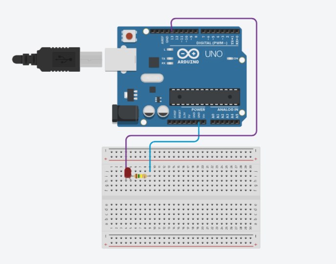

# blink-led with c language

## Descrição

Neste pequeno projeto, os conhecimentos básicos sobre arquietura de computadores foram necessários para o desenvolvimento do código - em C - e para a análise do microcontrolador utilizado - Arduino.

As principais características e partes do computador a serem estudadas neste projeto, são os registradores.

### O que são os registradores?

No contexto do Arduino, os registradores são componentes fundamentais dos microcontroladores AVR (Advanced Virtual RISC) que são comumente utilizados nos modelos de placas Arduino, como o ATmega328 no Arduino Uno. Os registradores são espaços de armazenamento de dados diretamente acessíveis na arquitetura do microcontrolador ou computador.

Existem vários tipos de registradores nos microcontroladores AVR, incluindo registradores de propósito geral (GPRs), registradores de controle, registradores de status, entre outros. Os registradores são usados para armazenar dados temporários e informações de controle.

Ao interagir com o hardware em nível mais baixo em linguagens de programação como C/C++/Assembly, pode-se acessar diretamente esses registradores para manipular portas de entrada/saída, configurar timers, controlar interrupções e realizar outras operações de baixo nível.

## Código

Este código é um programa básico em linguagem C para o microcontrolador AVR, que pode ser usado em placas Arduino baseadas em ATmega328 (como o Arduino Uno). 

O resultado final é um programa que pisca o LED conectado ao pino 13 em um intervalo de 1 segundo (ligado por 0,5 segundos, desligado por 0,5 segundos). 

Esse é um exemplo simples de manipulação direta de registradores para controle de E/S em um microcontrolador AVR usando o ambiente de desenvolvimento do Arduino. 

## Circuito

A imagem acima ilustra o circuito feito para ligar o LED à placa.

O LED foi conectado ao pino 13 e ao pino GND (ground), como declarado no código.

#### Elementos utilizados:
- 2 cabos jumper
- Protoboard
- LED
- Resistor
- Placa Arduino UNO

## Conclusão

Para maioria dos projetos com Arduino e entre outros microcontroladores, não é necessário manipular diretamente os registradores, visto que as funções de alto nível fornecidas pelas bibliotecas padrão do Arduino são suficientes e mais simples para desenvolvimento de projetos elaborados.

No entanto, o conhecimento acerca dos registradores e outros componentes de um computador/microcontrolador, pode ser útil para projetos que necessitam de otimização de desempenho ou para controle mais preciso do hardware.

### Referências

Este código foi feito com base em análise de vídeos relacionados a Arquitetura de Computadores, especificadamente, os registradores.

Além dos vídeos, o conteúdo do projeto também foi esclarecido durante as aulas da disciplina de Organização e Arquitetura de Computadores.

#### Videos
<a href="https://youtu.be/iXJGeQNUdpI?si=gtdrWItd7indpYSd">Blink LED Through Register Level Programming in Arduino #1</a>

<a href="https://youtu.be/9Q37tdEj1go?si=1lrTkTiQQZRpow_P">SISTEMAS DIGITAIS: REGISTRADORES E MEMÓRIA</a>

<a href="https://youtu.be/Zc_4NgoJthU?si=9-cMG0fH0TCDFkou">O que são os Registradores no Arduino</a>